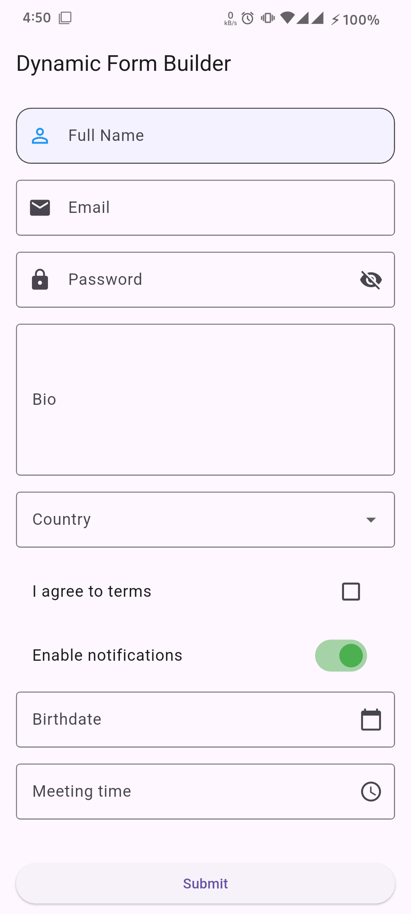

# dynamic_field_builder

[](https://pub.dev/packages/dynamic_field_builder)

**Build beautiful, reactive Flutter forms from a Dart map or JSON config — with zero boilerplate and full UI control.**

- 🔁 **Server‑driven UI ready** – define your entire form as JSON and ship it over the wire.
- 🎯 **Reactive & performant** – single controller holds all state, streams values and errors.
- 🎨 **100% customizable** – replace any internal widget, theme globally or per field.
- ✅ **Powerful validation** – declarative rules + custom async validators.
- 🧩 **Conditional visibility** – show/hide fields based on other fields’ values.
- ⚡ **Batteries included** – text, number, email, password (with toggle), multiline, dropdown, checkbox, switch, date, time, plus custom types.

---

## 📸 Preview



*The Power of Dynamic Forms: From simple inputs to complex, themed interfaces.*

*Fully customizable UI: One codebase, limitless designs.*

---

## 🚀 Installation

Add to your `pubspec.yaml`:

```yaml
dependencies:
  dynamic_field_builder: ^1.1.0
```

Then run `flutter pub get`.

---

## 🏁 Quick start

```dart
import 'package:dynamic_field_builder/dynamic_field_builder.dart';

final config = [
  FieldConfig(
    key: 'name', 
    type: FieldType.text, 
    label: 'Full Name',
    prefix: Icon(Icons.person),
    validation: {'required': true}
  ),
  FieldConfig(
    key: 'password', 
    type: FieldType.password, 
    label: 'Password',
    prefix: Icon(Icons.lock),
  ),
  FieldConfig(
    key: 'country', 
    type: FieldType.dropdown, 
    label: 'Country',
    options: [
      DropdownOption(value: 'us', label: 'United States'),
      DropdownOption(value: 'ca', label: 'Canada'),
    ]
  ),
];

DynamicForm(
  config: config,
  onSubmit: (values) => print(values),
)
```

---

## ✨ Features deep‑dive

### 1. Declarative field config (`FieldConfig`)

| Property          | Description                                                        |
|-------------------|--------------------------------------------------------------------|
| `key`             | Unique field identifier                                            |
| `type`            | One of `FieldType` (text, email, password, number, ...)            |
| `label` / `hint`  | Display text                                                       |
| `validation`      | Built‑in rules (`required`, `minLength`, `regex`, …)               |
| `prefix` / `suffix`| Custom **Widgets** (Icons, Images, etc.) for the field             |
| `activeColor`     | Custom color for Checkbox when active                             |
| `activeThumbColor`| Custom color for Switch thumb when active                        |
| `checkColor`      | Custom color for Checkbox tick                                     |
| `options`         | For `dropdown` fields                                              |
| `conditional`     | Show/hide based on other field value                               |
| `decorationProps` | Override `InputDecoration` properties for this field               |

### 2. Password Visibility Toggle
The `password` field type now comes with a built-in visibility toggle. It automatically adds a suffix icon that allows users to show or hide their password.

### 3. Prefix & Suffix Widgets
Unlike other libraries that only allow `IconData`, we allow any `Widget`.
```dart
FieldConfig(
  key: 'profile',
  type: FieldType.text,
  prefix: CircleAvatar(backgroundImage: AssetImage('assets/user.png')),
  suffix: TextButton(onPressed: () {}, child: Text('Verify')),
)
```

### 4. Custom Submit Button
Don't like the default button? Provide your own:
```dart
DynamicForm(
  config: config,
  submitButtonBuilder: (onSubmit) => MyCustomButton(
    onTap: onSubmit,
    title: 'SIGN UP',
  ),
  onSubmit: (values) => save(values),
)
```

### 5. Validation that grows with you
```dart
FieldConfig(
  key: 'password',
  type: FieldType.password,
  validation: {
    'required': true,
    'minLength': 8,
    'regex': r'^(?=.*[A-Z])(?=.*\d).+$',
  },
)
```

### 6. Conditional visibility
Show a field only when another field meets a condition:
```dart
FieldConfig(
  key: 'other_pet',
  type: FieldType.text,
  label: 'Which pet?',
  conditional: Conditional(
    dependsOnKey: 'has_pet',
    equals: [true],
  ),
),
```

### 7. Complete UI theming
**Global theme via `DynamicFormTheme`**:
```dart
DynamicForm(
  config: config,
  theme: DynamicFormTheme(
    inputDecoration: InputDecoration(
      border: OutlineInputBorder(borderRadius: BorderRadius.circular(12)),
    ),
    fieldPadding: const EdgeInsets.only(bottom: 20),
  ),
)
```

**Per-field overrides**:
```dart
FieldConfig(
  key: 'email',
  type: FieldType.email,
  decorationProps: {
    'filled': true,
    'fillColor': Colors.blue.withValues(alpha: 0.1),
    'focusedBorder': OutlineInputBorder(borderSide: BorderSide(color: Colors.blue)),
  },
)
```

### 8. Reactive `DynamicFormController`
Grab the controller to read values or trigger validation programmatically:
```dart
final controller = DynamicFormController();

// Validate whole form
if (controller.validate()) {
  print(controller.formData); 
}
```

---

## 📚 Full API reference
- **`DynamicForm`** – The main widget.
- **`DynamicFormController`** – State & validation.
- **`DynamicFormTheme`** – Global appearance.
- **`FieldConfig`** / **`FieldType`** / **`Conditional`** / **`DropdownOption`** – Data models.

---

## 🤝 Contributing
PRs welcome! Feel free to open issues or propose enhancements.

---

## 📄 License
MIT – see [LICENSE](LICENSE) file.